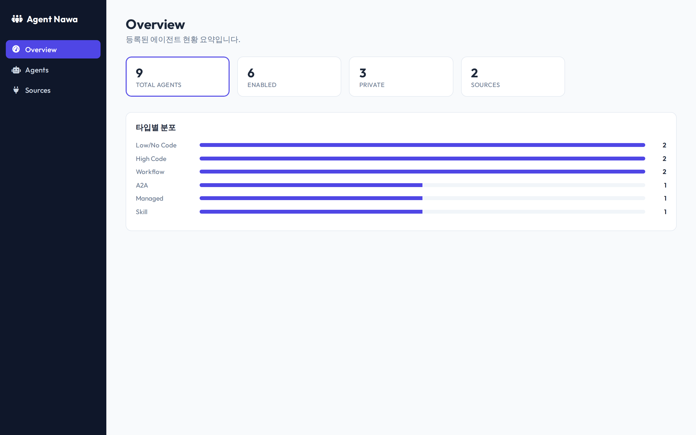
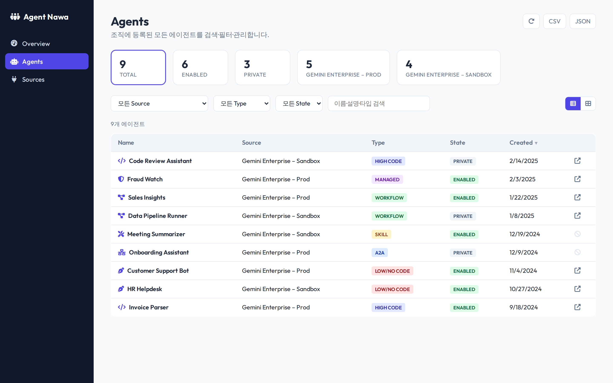
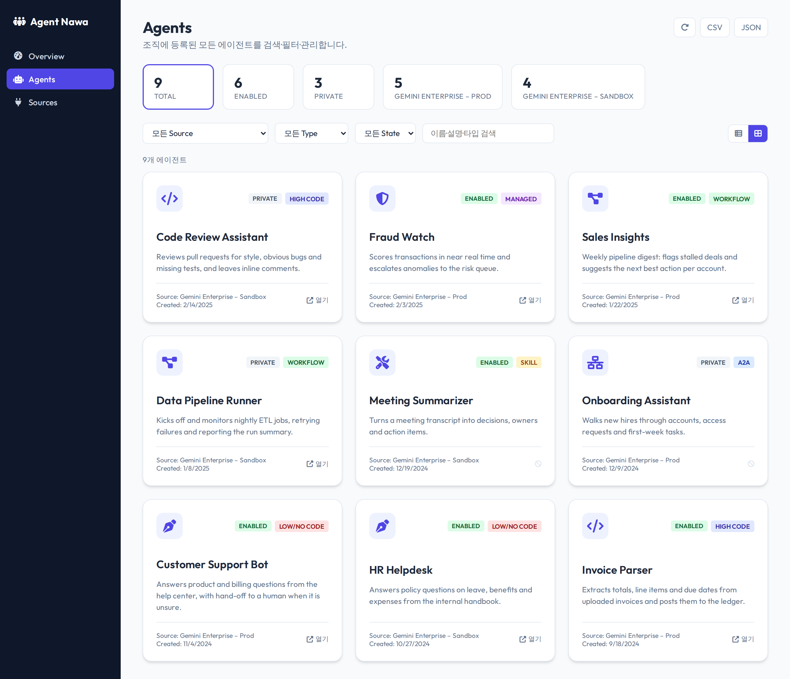
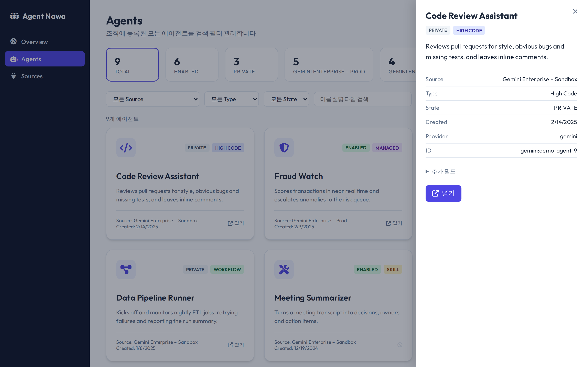
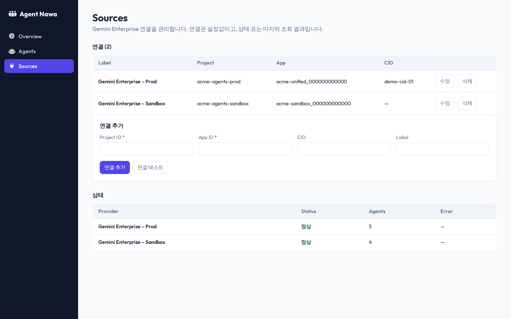

# Agent Nawa

Agent Nawa (에이전트 나와) is one place to find and open the AI agents your organization has registered. Different teams build agents on different platforms, and there is usually no single page that lists all of them. Agent Nawa reads those lists through a provider layer and shows them together, so someone looking for an agent does not have to know which platform it was built on.

Today it reads agents from Google Gemini Enterprise (Discovery Engine). The provider layer is where the extensibility lives: each platform is one small adapter that knows its own API, authentication, and links. Adding Microsoft Copilot Studio, Azure AI Foundry, or an in-house platform means writing another adapter, not changing the rest of the app.



## Screens

<table>
  <tr>
    <td width="50%"><br><sub><b>Agents</b> — every agent in one list, filtered by source, type, state, or free text, with sortable columns and CSV/JSON export.</sub></td>
    <td width="50%"><br><sub><b>Card view</b> — the same list as a card grid, one card per agent with its type and state.</sub></td>
  </tr>
  <tr>
    <td width="50%"><br><sub><b>Detail</b> — the full record for one agent, including any extra provider fields, with a link out to open it in its own platform.</sub></td>
    <td width="50%"><br><sub><b>Sources</b> — add, edit, delete, and test Gemini Enterprise connections; the status table shows the last fetch per source.</sub></td>
  </tr>
</table>

> Screenshots use synthetic data.

## How it works

The backend is FastAPI. Each provider is a class that talks to one platform and returns agents in a shared shape: a name, a description, a type, a state, an icon, and a link to open the agent. `GET /api/agents` calls every registered provider, merges the results, and sorts them by creation time. If one provider throws, the others still return, and the response carries a per-provider status so the page can show which one failed instead of erroring out entirely.

The frontend is plain HTML and JavaScript. It loads `/api/agents`, renders one card per agent, and filters on the client as you type in the search box, matching name, description, or type. Each card links out to open the agent in its own platform.

Agents in every state show up, each with a badge for its state (ENABLED, PRIVATE, and so on), so nothing is hidden. The Gemini adapter maps each one to a readable type: High Code, Low/No Code, A2A, Workflow, Skill, or Managed.

## Running locally

1. Install the dependencies:
   ```bash
   pip3 install -r requirements.txt
   ```
2. Sign in so the app can call Google APIs as you:
   ```bash
   gcloud auth application-default login
   ```
3. Set the environment variables (see Configuration below) and start the server:
   ```bash
   python3 main.py
   ```
4. Open http://localhost:8000.

## Configuration

You manage connections from the UI. Each connection is one Gemini Enterprise source: a project ID, an Agentspace app ID, an optional client ID (`cid`, used to build each agent's open link), and an optional label. Add, remove, and test connections from the page; the whole list is persisted as one JSON document.

Where that document lives depends on the environment. Locally it is a file, `config.json` by default (override with `CONFIG_PATH`). On Cloud Run set `CONFIG_BUCKET` to a GCS bucket name and the list is stored there as a single blob, `connections.json` by default (override with `CONFIG_OBJECT`).

For back-compat you can still seed a connection from environment variables. If no connections exist yet and `PROJECT_ID` and `AS_APP` are set (plus optional `CID`), the app creates one connection from them on first run and persists it to the store. You can keep these in a `.env` file; the app loads it on startup.

If no connection is configured, the app still runs and returns an empty list, so a missing variable will not crash it.

## Adding a provider

A provider is a class with a `name` and a `list_agents()` method that returns a list of `Agent` objects. Write the class in `providers.py`, then add it to `registry()` so it gets called. The adapter owns everything specific to its platform: the base URL, how it authenticates, how it pages through results, how it parses the response, and how it builds the open link. Nothing outside the adapter has to change.

The shared `Agent` shape gives every agent a global ID in the form `provider:native_id`, so two platforms can never collide on the same ID. Each adapter also keeps the raw platform response on the object for debugging, and the API strips it out before sending anything to the browser.

## Deploy to GCP with Terraform

For an enterprise install, use the Terraform module in [`terraform/`](terraform/). It provisions a dedicated service account, a config bucket (wired to `CONFIG_BUCKET`), an Artifact Registry repo, and the Cloud Run service, with the IAM the service needs to read Gemini agents across projects. The flow is build the image, push it to Artifact Registry, then `terraform apply`:

```bash
terraform -chdir=terraform init
terraform -chdir=terraform apply -target=google_artifact_registry_repository.repo \
  -var project_id=YOUR_PROJECT -var image=placeholder   # create the repo first

IMAGE="us-central1-docker.pkg.dev/YOUR_PROJECT/agent-nawa/agent-nawa:v1"
gcloud auth configure-docker us-central1-docker.pkg.dev
docker build -t "$IMAGE" . && docker push "$IMAGE"

terraform -chdir=terraform apply -var project_id=YOUR_PROJECT -var image="$IMAGE"
```

See [`terraform/README.md`](terraform/README.md) for cross-project access and enabling IAP.

### Quick deploy from source

For a throwaway instance you can skip Terraform and let Cloud Run build the image. The env vars just seed a first connection; you can also add connections from the UI afterward.

```bash
export CID="your-client-id"
export PROJECT_ID="your-project-id"
export AS_APP="your-app-id"

gcloud run deploy agent-nawa \
  --source . \
  --region us-central1 \
  --no-allow-unauthenticated --iap \
  --set-env-vars="CID=${CID},PROJECT_ID=${PROJECT_ID},AS_APP=${AS_APP}"
```
