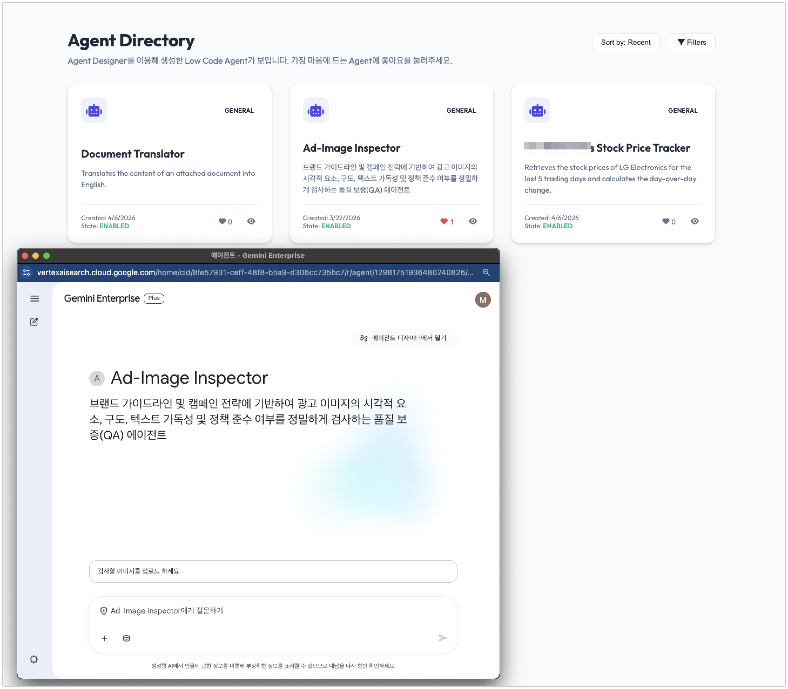

# Agent Nawa

Agent Nawa (에이전트 나와) is one place to find and open the AI agents your organization has registered. Different teams build agents on different platforms, and there is usually no single page that lists all of them. Agent Nawa reads those lists through a provider layer and shows them together, so someone looking for an agent does not have to know which platform it was built on.

Today it reads agents from Google Gemini Enterprise (Discovery Engine). The provider layer is where the extensibility lives: each platform is one small adapter that knows its own API, authentication, and links. Adding Microsoft Copilot Studio, Azure AI Foundry, or an in-house platform means writing another adapter, not changing the rest of the app.



## How it works

The backend is FastAPI. Each provider is a class that talks to one platform and returns agents in a shared shape: a name, a description, a type, a state, an icon, and a link to open the agent. `GET /api/agents` calls every registered provider, merges the results, and sorts them by creation time. If one provider throws, the others still return, and the response carries a per-provider status so the page can show which one failed instead of erroring out entirely.

The frontend is plain HTML and JavaScript. It loads `/api/agents`, renders one card per agent, and filters on the client as you type in the search box, matching name, description, or type. Each card links out to open the agent in its own platform.

Only agents in the ENABLED state show up. The Gemini adapter maps each one to a readable type: High Code, Low/No Code, A2A, Workflow, Skill, or Managed.

## Running locally

1. Install the dependencies:
   ```bash
   pip3 install -r requirements.txt
   ```
2. Sign in so the app can call Google APIs as you:
   ```bash
   gcloud auth application-default login
   ```
3. Set the environment variables (see Configuration below) and start the server:
   ```bash
   python3 main.py
   ```
4. Open http://localhost:8000.

## Configuration

Set these before starting the server. You can keep them in a `.env` file; the app loads it on startup.

- `PROJECT_ID`: your Google Cloud project ID.
- `AS_APP`: the Agentspace app ID whose agents you want to list.
- `CID`: the client ID used to build each agent's open link. This one is optional. Without it, the cards still render but the open link is dropped.

If no provider is configured, the app still runs and returns an empty list, so a missing variable will not crash it.

## Adding a provider

A provider is a class with a `name` and a `list_agents()` method that returns a list of `Agent` objects. Write the class in `providers.py`, then add it to `registry()` so it gets called. The adapter owns everything specific to its platform: the base URL, how it authenticates, how it pages through results, how it parses the response, and how it builds the open link. Nothing outside the adapter has to change.

The shared `Agent` shape gives every agent a global ID in the form `provider:native_id`, so two platforms can never collide on the same ID. Each adapter also keeps the raw platform response on the object for debugging, and the API strips it out before sending anything to the browser.

## Deploying to Cloud Run

You can deploy from source. This setup puts the app behind Identity-Aware Proxy, so IAP handles sign-in and passes the user's email in the `x-goog-authenticated-user-email` header.

```bash
export CID="your-client-id"
export PROJECT_ID="your-project-id"
export AS_APP="your-app-id"

gcloud run deploy agent-nawa \
  --source . \
  --region us-central1 \
  --no-allow-unauthenticated --iap \
  --set-env-vars="CID=${CID},PROJECT_ID=${PROJECT_ID},AS_APP=${AS_APP}"
```
